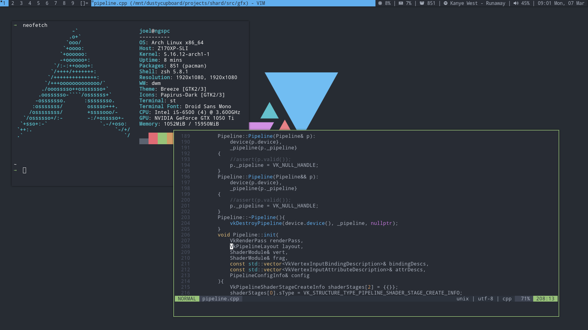

# NongusRice

# Dependencies
> ttf-droid 
> ttf-font-awesome 
> dmenu 
> playerctl 
> picom or compton 
> nitrogen (For wallpaper) 
> dunst 
> lf
> neovim
> Arch Linux (For the package count in the top bar)

# Install
1) Run install.sh.
2) Add bin and bin/statusbar to your path.
